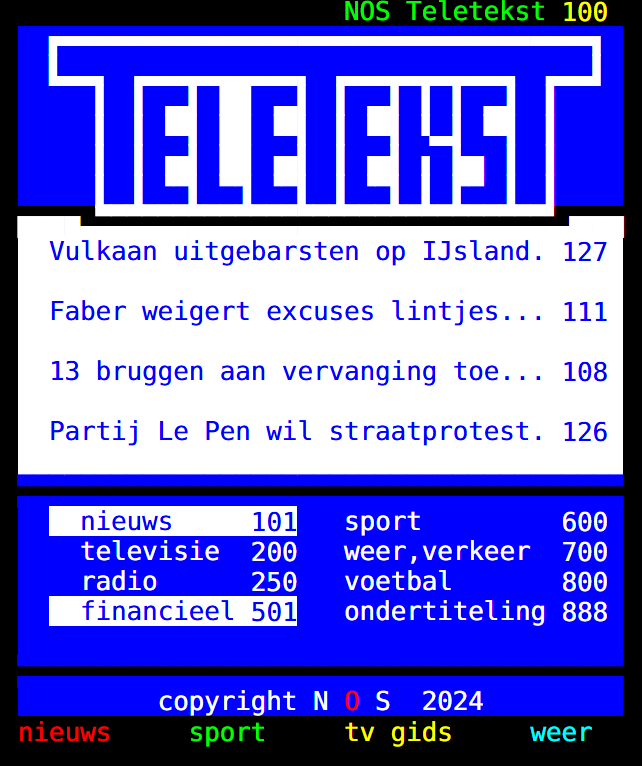
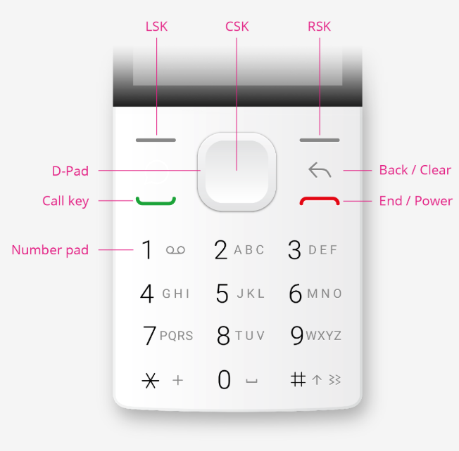
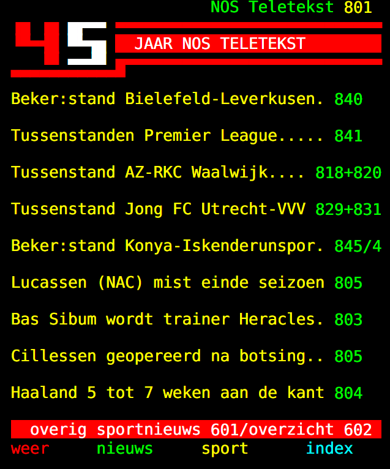

<style>
r { color: Red; background: Black }
y { color: Yellow; background: Black }
g { color: #0F0; background: Black }
c { color: Cyan; background: Black }
</style>

# NOS Teletekst

**Sinds 1 april 1980 actief. Nu ook naar Kaios na 45 jaar!**

Razendsnel toegang tot NOS Teletekst met onder andere nieuws, verkeersinformatie, weer, sportnieuws en natuurlijk sportuitslagen.



## Navigatie

Navigatie kan op verschillende manieren:

* Met de *Softkeys* LSK en RSK navigeer je naar de vorige resp. de volgende (sub)pagina.
* Met de nummers op het *Number pad* spring je naar een specifieke pagina na het invoeren van 3 nummers.
* Indien pagina niet gevonden is kan met CSK terug naar pagina 100 gesprongen worden
* Met 1x # gevolgd door CSK spring naar het <r>rode</r> item
* Met 2x # gevolgd door CSK spring naar het <g>groene</g> item
* Met 3x # gevolgd door CSK spring naar het <y>gele</y> item
* Met 4x # gevolgd door CSK spring naar het <c>cyane</c> item




## Hoe te verkrijgen

Het is de bedoeling de app op de Kaios Store ter beschikking te maken. Daarnaast kan het van github gedownload worden:

````bash
git clone https://github.com/henkkh/tt-kaios
````


## Zelf installeren

Gebruik de Web IDE in  [Waterfox Classic](https://classic.waterfox.net/) om de app op je device te laden. Bijvoorbeeld de Nokia Flip 2720

